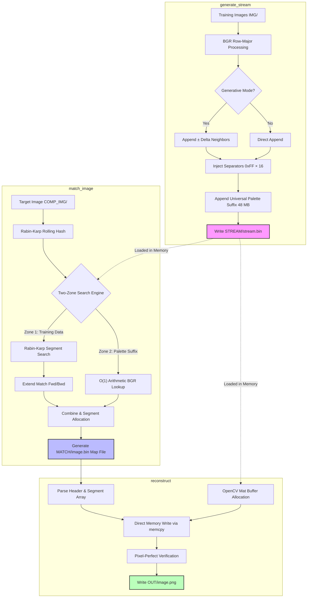

# Reference-Based Shared Stream Compression

> **Experimental image compression via retrieval-based spatial search over a massive pre-shared visual memory.**

[](https://isocpp.org/)
[](https://opencv.org/)
[]()
[]()

**Author:** Mohd Ayan Khan — Independent Researcher
**Contact:** [yoru.ayan@gmail.com](mailto:yoru.ayan@gmail.com)
**Repository:** [GitHub](https://github.com/aniway89/Shared-Generative-Stream-Compression)

---

## Overview

Traditional image compression (JPEG, WebP, AVIF) relies on localized mathematical approximations such as the Discrete Cosine Transform. This project, the **Shared Generative Stream Compression (SGSC)** framework, takes a fundamentally different approach: images are encoded strictly as sequences of stream offsets, segment lengths, and reconstruction coordinates, referencing a massive pre-shared visual memory that both the sender and receiver hold in common.

When strong structural similarity exists between the target image and the training domain, this approach achieves extraordinary compression ratios — up to **3.1 million ×** in benchmark tests. However, the framework has significant real-world limitations (detailed below) and is intended as a research prototype rather than a production codec replacement.

---

## System Architecture

The pipeline is divided into four dependent stages built on a shared, deterministic stream layout:



---

## Core Methodology

### 1. Two-Zone Stream Design

The pre-shared visual memory (`stream.bin`) is divided into two distinct operational zones:

**Zone 1 — Training Data (Indexed)**
Compiled from curated domain images and indexed via a high-performance hash map using **Rabin-Karp rolling hashes** over a sliding window of `INDEX_CHUNK = 16` bytes.

**Zone 2 — Universal Palette Suffix (Non-Indexed)**
To prevent out-of-memory (OOM) failures that would arise from hashing millions of palette entries, the stream appends all 16,777,216 possible BGR color triplets (adding exactly 48 MB). Because the palette follows a fixed mathematical order, the offset for any unmatched BGR pixel is computed in O(1) time:

$$\texttt{offset} = \texttt{palette\\_start} + (B \times 65536 + G \times 256 + R) \times 3$$

### 2. Generative Data Streaming

When `ENABLE_GENERATIVE_MODE` is set, the stream compiler appends not only original BGR pixel triplets but also nearby color variants modified by a configurable ±delta offset. This expands coverage over fine color gradients, enabling segment matches to grow longer across compression noise and lighting discrepancies.

### 3. Rabin-Karp Segment Matching Engine

The encoder searches for duplicate byte runs in three phases:

1. **Full Match Search** — Checks whether the entire image already exists in the stream. A hit reduces the entire image to a single 24–28 byte segment entry.
2. **Segmented Match Search** — If no full match is found, the encoder matches 16-byte chunks and dynamically extends them in both directions using `extend_match`.
3. **Palette Fallback** — Any remaining unmatched bytes are resolved via the O(1) Universal Palette, inserting 3-byte pixel entries to guarantee 100% reconstruction coverage with no black areas.

---

## Benchmark Results

### Hardware

All benchmarks were run on a resource-constrained consumer laptop, which exposed the framework's real computational boundaries:

| Component | Specification |
| :--- | :--- |
| **CPU** | AMD Ryzen 3 3250U — 2 cores, 4 logical processors @ 2.60 GHz (max 2.74 GHz) |
| **Cache** | 194 KB L1 / 1 MB L2 / 4 MB L3 |
| **RAM** | 12 GB DDR4 (~5.6 GB available after OS overhead) |
| **GPU** | Integrated AMD Radeon™ (2 GB dedicated, 4.9 GB shared) |
| **Thermal note** | CPU idled at **93 °C** at 4% utilization, causing severe throttling during exhaustive search runs |

### Results

| Test Case | Original Size | Compressed Size | Ratio | Match Time | Reconstruct Time | Result |
| :--- | :---: | :---: | :---: | :---: | :---: | :---: |
| Mars Map (`Big mars map 2.png`) | 82.95 MB | **28 Bytes** | **3,106,258 ×** | 2.18 s | N/A | ✅ Pixel-perfect |
| Exact stream match (`PTI2.png`) | 3.44 MB | **24 Bytes** | **150,180 ×** | 0.08 s | 0.22 s | ✅ Pixel-perfect |
| Segment-based match (`PTI1.jpg`) | 247.30 KB | **28 Bytes** | **9,044 ×** | 0.01 s | N/A | ✅ Pixel-perfect |
| Unseen domain (`PTI1 cp.jpg`) | 15.57 KB | 5.21 KB | **2.98 ×** | 527.96 s | 0.001 s | ⚠️ Partial match |

> **Key Insight:** Domain similarity matters far more than stream size. High-similarity targets match in milliseconds; out-of-domain targets trigger exhaustive segmented search and palette fallback, generating hundreds of segments and taking minutes to encode. The unseen-domain case produced 333 separate segments and took nearly 9 minutes.

---

## Repository Structure

```
├── experiments/               # Archived prototypes, visualizations, and datasets
│   ├── Dv1/                   # V1–V3 C++ codebase drafts
│   ├── outputs/               # CSV and Markdown benchmark outputs
│   ├── graph.py               # Matplotlib visualization dashboard
│   ├── compress_tile.py       # Historical tiling compression models
│   └── ...                    # Python compression prototypes
│
├── IMG/                       # [User input] Training images used to build the stream
├── COMP_IMG/                  # [User input] Target images to compress
├── STREAM/                    # [Auto-generated] Output stream.bin
├── MATCH/                     # [Auto-generated] Compressed coordinate binaries
├── OUT/                       # [Auto-generated] Reconstructed output PNG images
│
├── config.h                   # Global constants, deltas, and Rabin-Karp parameters
├── logger.h                   # Timer, file-size formatting, and logging utilities
├── generate_stream.cpp        # Stage 1: Stream builder
├── match_image.cpp            # Stages 2–3: Rabin-Karp rolling encoder
├── reconstruct.cpp            # Stage 4: Decompressor and pixel-perfect verifier
│
├── build.sh                   # GCC compilation script
├── runpipeline.sh             # Full pipeline runner (generate → match → reconstruct)
├── benchmark.log              # Live execution logs
└── README.md                  # This document
```

---

## Getting Started

### Prerequisites

- A C++17-compatible compiler (`g++` recommended)
- OpenCV 4 C++ runtime libraries

### Quickstart

```bash
# 1. Clone the repository
git clone https://github.com/aniway89/Shared-Generative-Stream-Compression.git
cd Shared-Generative-Stream-Compression

# 2. Add your datasets
#    Place training images in IMG/
#    Place target images in COMP_IMG/

# 3. Compile
chmod +x build.sh && ./build.sh

# 4. Run the full pipeline
chmod +x runpipeline.sh && ./runpipeline.sh
```

Outputs are written to:
- `STREAM/stream.bin` — the pre-shared dictionary
- `MATCH/` — compressed coordinate files
- `OUT/` — reconstructed and verified images

---

## Limitations

| Limitation | Description |
| :--- | :--- |
| **Search complexity** | Sequential CPU scanning of streams from 5 MB to 700 MB is computationally demanding, causing severe thermal throttling on standard consumer hardware. |
| **Byte-perfect sync requirement** | The receiver must hold an exact copy of the `stream.bin` used during encoding. A single byte of drift causes complete decoding failure. |
| **Domain dependency** | A stream trained on face images will fail to meaningfully compress landscape or geographic imagery, degrading the ratio to near baseline. |

---

## Future Work

1. **CUDA Parallel Traversal** — Port the Rabin-Karp matching loop to parallel GPU threads, scaling stream traversal to gigabytes in real time.
2. **Approximate Nearest-Neighbor (ANN) Search** — Replace raw byte matching with high-dimensional vector search (e.g., HNSW or FAISS) over learned image embeddings.
3. **2D Spatial Patch Indexing** — Shift from 1D sequential byte matching to hierarchical 2D rectangular patch indexing to better capture local spatial structure and transformations.

---

## References

1. R. M. Karp and M. O. Rabin, "Efficient randomized pattern-matching algorithms," *IBM J. Res. Develop.*, vol. 31, no. 2, pp. 249–260, Mar. 1987.
2. M. Okade and J. Mukherjee, "Discrete Cosine Transform: A Revolutionary Transform That Transformed Human Lives," *IEEE Circuits Syst. Mag.*, vol. 22, no. 4, pp. 58–61, 2022.
3. G. K. Wallace, "The JPEG still picture compression standard," *Commun. ACM*, vol. 34, no. 4, pp. 30–44, Apr. 1991.
